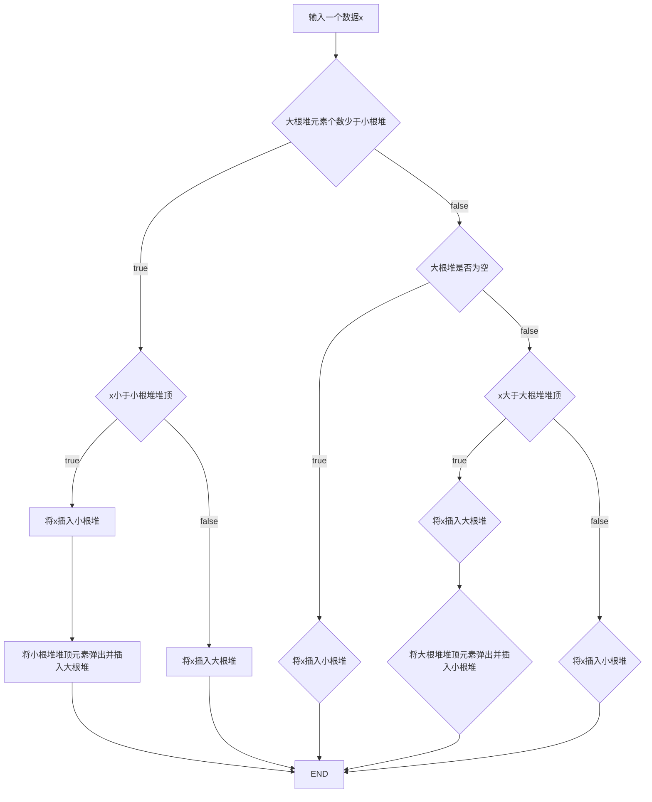

# 数据结构大作业报告


## 大作业		小蓝鲸的财务统计任务


​												**计算机科学与技术系     **


​												**181860055 		刘国涛**  


​									邮箱:181860055@smail.nju.edu.cn


​											


**2020年1月1日**					


------


## 任务一：统计多个收入区间内的平均收入

### 任务描述

> 给定n个市民的收入和m个询问区间[l~i~,r~i~]
>
> 对于每个询问区间[l~i~,r~i~]，你的程序需要计算在l~i~到r~i~范围的收入的平均值

### 复杂度要求

时间复杂度$O((n+m) log (n+2m)$以内

### 算法描述

1. 将n个市民的收入进行排序得到数组`income`
2. 计算收入的前序和数组`presum`
3. 在每次询问区间[l~i~,r~i~]时，通过二分查找分别找到区间左右端点在数组`income`中对应的下标`leftAddr`,`rightAddr`
4. 用前缀和数组计算出该区间的平均数$\frac{presum_{rightAddr}-presum_{leftAddr}}{rightAddr-leftAddr}$


**二分查找：**

- 二分查找时，数据中可能存在重复元素，在查找`leftAddr`时，若结果为重复元素，则需要返回重复元素所在区间的最左端；在查找`rightAddr`时，若结果存在重复元素，则需要返回重复元素所在区间的最右端
- 二分查找得到的区间是[`leftAddr`,`rightAddr`)
- 二分查找可能出现待查找元素`target`不是`income`数组中的元素，则返回`income[i+1],income[i]<target<income[i+1]`


**注意：**如果$rightAddr-leftAddr$则直接输出0


### 复杂度分析

- 输入：$O(n+m)$
- 对`income`排序：堆排序平均时间复杂度$O(nlog(n))$
- 计算前缀和：$O(n)$
- m次询问：一次二分查找$O(log(n))$，询问复杂度为$O(mlog(n))$
- 计算平均数：$O( 1 )$

**总时间复杂度为$O((n+m)log(n))$**


### 代码实现

#### 堆排序实现

```c++
void siftDown(int *a, int start, int m) {
	int i = start;
	int j = 2 * i + 1; //j是i的左子女位置
	int tmp = a[i];
	while (j <= m) {   //检查是否到最后位置
		if (j<m&&a[j]<a[j + 1])j++;     //让j指向两子女中的大者
		if (tmp >= a[j])break;  //大则不做调整
		else { a[i] = a[j]; i = j; j = 2 * j + 1; }//否则大者上移, i, j下降
	}
	a[i] = tmp;//回放tmp中暂存的元素
}
void HeapSort(int *a, int n) {
	int i;
	for (i = (n - 2) / 2; i >= 0; i--) 	//将表转换为堆
		siftDown(a, i, n - 1);
	for (i = n - 1; i >= 0; i--) {		//对表排序
		int tmp = a[0];
		a[0] = a[i];
		a[i] = tmp;
		siftDown(a, 0, i - 1);
	}
};
```

#### 计算前缀和

```c++
for(int i=0;i<n;i++){   		// get presum
    presum[i+1]=presum[i]+income[i];
}
```

#### 区间询问

```c++
int check(int n,int m,int *income,ull *presum){
    int l,r;
    int leftAddr,rightAddr;
    for(int i=0;i<m;i++){
        scanf("%d%d",&l,&r);
        //所有的区间都是[l,r)
        leftAddr=binarySearch(income,0,n,l,0);
        rightAddr=binarySearch(income,0,n,r,1);
        
        int num=rightAddr-leftAddr;
        if(num==0)
            printf("0\n");
        else{
            printf("%llu\n",(presum[rightAddr]-presum[leftAddr])/num);
        } 
           
    }
}
```

#### 二分查找

```c++
int binarySearch(int *arr,int l,int r,int target,bool mode){
    register int left=l,right=r;
    register int mid;
    while(left<right){
        mid = (left+right)>>1;
        if(arr[mid]<target){
            left=mid+1;
        }
        else if(arr[mid]>target){
            right=mid;
        }
        else{
            //处理重复数据的方式
            if(mode){               //区间最右
                right=r;
                while(mid<right&&arr[mid]==target)
                    ++mid;
            }
            else{                   //区间最左
                left=l;
                while(mid>=left&&arr[mid-1]==target)
                    --mid;
            }   
            return mid;
        }
    }
    //target不在arr中
	//选择区间最右
    if(arr[mid]<target&&mid<r)
    	++mid;
    
	return mid;     
}
```


## 任务二：实时统计收入的中位数

### 任务描述

> 对于n个市民，逐一获取每个市民的年收入。当获取第k个年收入时，统计并输出前k个年收入的中位数
>
> 注：当k为技术时，直接输出第$\frac{k+1}{2}$大的收入；当k为偶数时，输出第$\frac{k}{2}$和$\frac{k}{2}+1$大的收入的平均值(k>=1)

### 复杂度要求

时间复杂度$O(nlog(n))$以内

### 算法描述

**整体思路**

1. 大根堆存放小k/2个数据，小根堆存放大k/2个数据
2. 这样大根堆的堆顶便是当前k个数据中第k/2小的数据，小根堆堆顶便是第k/2大的数据
3. 通过对两个堆顶元素的计算即可得到中位数

**对两个堆之间的维护**




### 复杂度分析

在输入第k个数据时，如果对一个堆直接插入需要`log k`，对两个堆之间进行数据调整需要`3log k`，因此维护两个堆的开销是$O(log k)$级别的

因此总时间复杂度是$O(nlogn)$

### 代码实现

#### 小根堆模板实现

```c++
template<class T>
class MinHeap{
public:
    MinHeap(int size);
    MinHeap(T arr[],int n);
    bool insert(T ele);
    bool pop();
    bool isFull();
    bool isEmpty();
    void print();
    int Size();
    T top();
private:
    T *heap;
    int currentSize;
    int maxHeapSize;
    void siftDown(int start,int end);
    void siftUp(int start);
};

template<class T>
MinHeap<T>::MinHeap(int size){
    maxHeapSize=size;
    heap=new T[size];
    currentSize=0;
    maxHeapSize=size;
}

template<class T>
MinHeap<T>::MinHeap(T arr[],int n){
    maxHeapSize=n;
    heap=new T[maxHeapSize];
    currentSize=n;
    for(int i=0;i<n;i++){
        heap[i]=arr[i];
    }
    int currentPos=(n-2)/2;
    while(currentPos>=0){
        siftDown(currentPos,currentSize-1);
        currentPos--;
    }
}

template<class T>
bool MinHeap<T>::isFull(){
    return currentSize==maxHeapSize;
}

template<class T>
bool MinHeap<T>::isEmpty(){
    return currentSize==0;
}

template<class T>
void MinHeap<T>::siftDown(int start,int end){
    T tmp=heap[start];
    int i=start;
    int j=i*2+1;
    while(j<=end){
        if(j<end&&heap[j]>heap[j+1])j++;
        if(tmp>heap[j]){
           heap[i]=heap[j];
           i=j;
           j=i*2+1; 
        }
        else{
            break;
        }
    }
    heap[i]=tmp;
}

template<class T>
void MinHeap<T>::siftUp(int start){
    T tmp=heap[start];
    int j=start,i=(j-1)/2;
    while(j>0){
        if(heap[i]>tmp){
            heap[j]=heap[i];
            j=i;
            i=(j-1)/2;
        }
        else{
            break;
        }
    }
    heap[j]=tmp;
}

template<class T>
bool MinHeap<T>::pop(){
    if(this->isEmpty())return false;
    heap[0]=heap[currentSize-1];
    siftDown(0,--currentSize-1);
    return true;
}

template<class T>
bool MinHeap<T>::insert(T ele){
    if(this->isFull())return false;
    heap[currentSize]=ele;
    siftUp(currentSize++);
    return true;
}

template<class T>
void MinHeap<T>::print(){
    for(int i=0;i<currentSize;i++){
        cout<<heap[i]<<' ';
    }
    cout<<endl;
}

template<class T>
int MinHeap<T>::Size(){
    return currentSize;
}

template<class T>
T MinHeap<T>::top(){
    return heap[0];
}
```

#### 小根堆的数据的结构

```c++
struct lessInCome{
    int val;
    bool operator>(lessInCome& x){
        return val<x.val;
    }
    friend bool operator<(const int x,const lessInCome& y){
        return x<y.val;
    }
    lessInCome(int v):val(v){}
    lessInCome(){}
    friend ostream& operator<<(ostream& out,const lessInCome& c){
        out<<c.val;
        return out;
    }
};
```

#### 大根堆的数据的结构

```c++
struct moreInCome{
    int val;
    bool operator>(moreInCome& x){
        return val>x.val;
    }

    friend bool operator>(const int x,const moreInCome& y){
        return x>y.val;
    }
    moreInCome(int v):val(v){}
    moreInCome(){}
    friend ostream& operator<<(ostream& out,const moreInCome& c){
        out<<c.val;
        return out;
    }
};
```

#### 堆之间的维护

```c++
	MinHeap<lessInCome> minHeap(n);//小根堆存放大 k/2 个数据  
	MinHeap<moreInCome> maxHeap(n);//大根堆存放小 k/2 个数据

    for(int i=0,x;i<n;i++){
        cin>>x;
        //维护两个堆
        if(maxHeap.Size()<minHeap.Size()){
            if(x<minHeap.top()){
                minHeap.insert(x);
                x=minHeap.top().val;
                minHeap.pop();
                maxHeap.insert(x);
            }
            else
                maxHeap.insert(x);
        }
        else{
            if(maxHeap.Size()==0){
                minHeap.insert(x);
            }
            else if(x>maxHeap.top()){
                maxHeap.insert(x);
                x=maxHeap.top().val;
                maxHeap.pop();
                minHeap.insert(x);
            }
            else
                minHeap.insert(x);
        }
        if(i&1)  //计算中位数
            ans=(minHeap.top().val+maxHeap.top().val)/2;
        else
            ans=minHeap.top().val;
        cout<<ans<<endl;
    }
```


## 任务三：实时统计当前最高的k个收入

### 任务描述

> 给定 n 个市民的年收入，以及查询参数 k，要求实时反馈出所有收入中最高的 k 个收入。收入信息按行给出，每行表示一个市民的年收入。 当该行的内容为“Check”字符串时，要求输出到上一条收入为止的所有收入中，最高的 k 个收入。如果 k 值超过了当前已经存储的收入数目，则仅需输出已有的数据。 输出在一行完成。

### 复杂度要求

时间复杂度$O(nklog(k))$以内

### 算法描述

**数据存储**

使用容量为k的小根堆MinHeap存储最高的k个收入

在每次插入时，如果堆满，则比较待插入数据和堆顶的大小

若堆顶更小，则将堆顶赋值为待插入数据，并对堆进行调整

**数据输出**

输出需要按照收入由大到小的顺序输出（根据样例数据推测）

因此实现一友元函数`orderPrint(MinHeap<int> mp)`实现堆数据的顺序输出

在`mp`非空时不断将其栈顶元素弹出，并存储在一数组中，然后将数组所有元素倒序输出即可得到由大到小的数据

> 为避免调用`orderPrint`时不断申请`mp`的内存空间，这里重载了`MinHeap`的拷贝构造函数，并用一全局数组作为拷贝构造的`MinHeap`对象的数据数组，具体实现可见[代码实现]()部分

### 复杂度分析

对小根堆的维护的时间复杂度$O(nlog(k))$

一次数据输出的时间开销为$O(klog(k))$

因此假设最坏情况为进行了n次Check，则数据输出的总时间开销为$O(nklog( k ))$

### 代码实现

**小根堆实现**

```c++
int *HeapData;
int *reverseHelper;
template<class T>
class MinHeap{
public:
    MinHeap(int size);
    MinHeap(const MinHeap<T>& mp){
        currentSize=mp.currentSize;
        maxHeapSize=mp.maxHeapSize;
        heap=(T*)HeapData;
        for(int i=0;i<currentSize;++i){
            heap[i]=mp.heap[i];
        }
    }
    MinHeap(T arr[],int n);
    bool insert(T ele);
    T pop();
    bool isFull();
    bool isEmpty();
    void print();
    int Size();
    T top();
    friend void orderPrint(MinHeap<int> mp){
    	int i=0;
    	while(!mp.isEmpty())
        	reverseHelper[i++]=mp.pop();
    	while(i-->0)
			cout<<reverseHelper[i]<<' ';
        cout<<endl;
    }
    
private:
    T *heap;
    int currentSize;
    int maxHeapSize;
    void siftDown(int start,int end);
    void siftUp(int start);
};

template<class T>
MinHeap<T>::MinHeap(int size){
    maxHeapSize=size;
    heap=new T[size];
    currentSize=0;
    maxHeapSize=size;
}

template<class T>
MinHeap<T>::MinHeap(T arr[],int n){
    maxHeapSize=n;
    heap=new T[maxHeapSize];
    currentSize=n;
    for(int i=0;i<n;i++){
        heap[i]=arr[i];
    }
    int currentPos=(n-2)/2;
    while(currentPos>=0){
        siftDown(currentPos,currentSize-1);
        currentPos--;
    }
}

template<class T>
bool MinHeap<T>::isFull(){
    return currentSize==maxHeapSize;
}

template<class T>
bool MinHeap<T>::isEmpty(){
    return currentSize==0;
}

template<class T>
void MinHeap<T>::siftDown(int start,int end){
    T tmp=heap[start];
    int i=start;
    int j=i*2+1;
    while(j<=end){
        if(j<end&&heap[j]>heap[j+1])j++;
        if(tmp>heap[j]){
           heap[i]=heap[j];
           i=j;
           j=i*2+1; 
        }
        else{
            break;
        }
    }
    heap[i]=tmp;
}

template<class T>
void MinHeap<T>::siftUp(int start){
    T tmp=heap[start];
    int j=start,i=(j-1)/2;
    while(j>0){
        if(heap[i]>tmp){
            heap[j]=heap[i];
            j=i;
            i=(j-1)/2;
        }
        else{
            break;
        }
    }
    heap[j]=tmp;
}

template<class T>
T MinHeap<T>::pop(){    
    T tmp=heap[0];
    heap[0]=heap[currentSize-1];
    siftDown(0,--currentSize-1);
    return tmp;
}

template<class T>
bool MinHeap<T>::insert(T ele){
    if(this->isFull()){
    	if(heap[0]<ele){
	    	heap[0]=ele;
	    	siftDown(0,currentSize-1);
	    	return true;
	    }
    	else return false;	    		
    }
    heap[currentSize]=ele;
    siftUp(currentSize++);
    return true;
}

template<class T>
void MinHeap<T>::print(){
    for(int i=0;i<currentSize;i++){
        cout<<heap[i]<<' ';
    }
    cout<<endl;
}

template<class T>
int MinHeap<T>::Size(){
    return currentSize;
}

template<class T>
T MinHeap<T>::top(){
    return heap[0];
}
```

**主要过程**

```c++
    while(scanf("%s",s)==1){
        if(s[0]=='C'){  //s=="Check"
            orderPrint(mp);
        }
        else{
            sscanf(s,"%d",&x);
            mp.insert(x);
        }
    }
```

## 任务四：查找蓝鲸市某市民

### 任务描述

> 给定所有蓝鲸市民的身份证号，共n个。市民与身份证号一一对应。身份证号总共有18位，由0~9的数字和大写字母组成。
>
> 再给一个市民的身份证号，需要判断这个市民是否属于蓝鲸市

### 复杂度要求

算法的存储空间尽量小，每次查询的平均时间复杂度尽量控制在$O(1)$

### 算法描述

使用`Bloom Filter`实现存储和查询：

**存储实现**

1. 每输入一个字符串`str`（身份证号）
2. 使用k个哈希函数对字符串`str`哈希得到k个哈希值{x~1~,x~2~,……,x~k~}
3. 将m bit的二进制串`bloom_filter`的第x~i~位置为1

**查询实现**

1. 输入一个待查询的字符串`str`
2. 使用k个哈希函数对字符串`str`哈希得到k个哈希值{x~1~,x~2~,……,x~k~}
3. 在`bloom_filter`中判断第x~i~位是否为1，如果出现第x~i~位不为1，则认为`str`不在`bloom_filter`中，即该市民不属于蓝鲸市

**Bloom Filter的参数**

> 如何根据身份证号的个数n来确定
>
> - 哈希函数的个数k
> - 二进制串的长度m

假设我们允许的假阳性概率(FPR)$f=0.5\%$

当集合S={x~1~,x~2~,…,x~n~}的所有元素都被k个哈希函数映射到m位的位数组中时，这个位数组中某一位还是0的概率是
$$
p=(1-\frac1 m)^{kn}\approx e^{-kn/m}
$$
(1-p)^k^表示k次哈希都刚好选中1的区域，即FPR：
$$
f=(1-e^{-kn/m})^k=(1-p)^k
$$
即
$$
f=exp(kln(1-e^{-kn/m}))
$$
令
$$
\begin{align}
g&=kln(1-e^{-kn/m})
\\&=-\frac m n ln(p)ln(1-p)
\end{align}
$$
所以当p=1/2时错误率最小，也就是让一半的位空着
$$
k=ln2*\frac m n
$$

$$
\begin{align}
m&=n*log_2 e*log_2(1/f)
\\&\approx n*1.44*log_2(1/f)
\end{align}
$$

代入$f=0.5\%$，得$m\approx11n,k\approx8$


**哈希函数**

在哈希类中，共实现了6种哈希函数JSHash、RSHash、BKDRHash、SDBMHash、DJBHash、DEKHash，其中BKDHash可以根据不同的`seed`得到不同的Hash值

### 复杂度分析

**空间复杂度**

`Bloom Filter`需要m bit的空间，由$m=11n$可知，空间复杂度为$O(n)$

**时间复杂度**

每个哈希函数计算的开销为$O(1)$，共有$k=8$个哈希函数

因此每次查询的时间复杂度为$O(1)$

而每次存储的时间复杂度也是$ O(1)$

### 代码实现

**哈希类的实现**

```c++
class Hash;
typedef unsigned long (Hash::*HashFunc)(const string&);
class Hash {
private:
	unsigned long JSHash(const string& str) {
		unsigned long hash = 1315423911;
		for (int i = 0; i < str.length(); ++i) {
			hash ^= ((hash << 5) + str.at(i) + (hash >> 2));
		}
		return hash;
	}
	unsigned long RSHash(const string& str) {
		int b = 378551;
		int a = 63689;
		unsigned long hash = 0;
		for (int i = 0; i < str.length(); i++) {
			hash = hash * a + str.at(i);
			a = a * b;
		}
		return hash;
	}
	unsigned long BKDRHash0(const string& str) {
		unsigned long seed = 31;//31 131 1313 13131 131313 1313131
		unsigned long hash = 0;
		for (int i = 0; i < str.length(); ++i) {
			hash = (hash*seed) + str.at(i);
		}
		return hash;
	}
	unsigned long BKDRHash1(const string& str) {
		unsigned long seed = 131;//31 131 1313 13131 131313 1313131
		unsigned long hash = 0;
		for (int i = 0; i < str.length(); ++i) {
			hash = (hash*seed) + str.at(i);
		}
		return hash;
	}
	unsigned long BKDRHash2(const string& str) {
		unsigned long seed = 1313;//31 131 1313 13131 131313 1313131
		unsigned long hash = 0;
		for (int i = 0; i < str.length(); ++i) {
			hash = (hash*seed) + str.at(i);
		}
		return hash;
	}
	unsigned long BKDRHash3(const string& str) {
		unsigned long seed = 13131;//31 131 1313 13131 131313 1313131
		unsigned long hash = 0;
		for (int i = 0; i < str.length(); ++i) {
			hash = (hash*seed) + str.at(i);
		}
		return hash;
	}
	unsigned long BKDRHash4(const string& str) {
		unsigned long seed = 131313;//31 131 1313 13131 131313 1313131
		unsigned long hash = 0;
		for (int i = 0; i < str.length(); ++i) {
			hash = (hash*seed) + str.at(i);
		}
		return hash;
	}
	unsigned long BKDRHash5(const string& str) {
		unsigned long seed = 1313131;//31 131 1313 13131 131313 1313131
		unsigned long hash = 0;
		for (int i = 0; i < str.length(); ++i) {
			hash = (hash*seed) + str.at(i);
		}
		return hash;
	}
	unsigned long BKDRHash6(const string& str) {
		unsigned long seed = 13131313;//31 131 1313 13131 131313 1313131
		unsigned long hash = 0;
		for (int i = 0; i < str.length(); ++i) {
			hash = (hash*seed) + str.at(i);
		}
		return hash;
	}
	unsigned long SDBMHash(const string& str) {
		unsigned long hash = 0;
		for (int i = 0; i < str.length(); ++i) {
			hash = str.at(i) + (hash << 6) + (hash << 16) - hash;
		}
		return hash;
	}
	unsigned long DJBHash(const string& str) {
		unsigned long hash = 5381;
		for (int i = 0; i < str.length(); ++i) {
			hash = ((hash << 5) + hash) + str.at(i);
		}
		return hash;
	}
	unsigned long DEKHash(const string& str) {
		unsigned long hash = str.length();
		for (int i = 0; i < str.length(); ++i) {
			hash = ((hash << 5) ^ (hash >> 27)) ^ str.at(i);
		}
		return hash;
	}
	int k;
	HashFunc *hashFunc;
public:
	Hash(int k) {
		this->k = k;
		hashFunc = new HashFunc[12];
		hashFunc[0] = &Hash::JSHash;
		hashFunc[1] = &Hash::RSHash;
		hashFunc[2] = &Hash::SDBMHash;
		hashFunc[3] = &Hash::DJBHash;
		hashFunc[4] = &Hash::DEKHash;
		hashFunc[5] = &Hash::BKDRHash0;
		hashFunc[6] = &Hash::BKDRHash1;
		hashFunc[7] = &Hash::BKDRHash2;
		hashFunc[8] = &Hash::BKDRHash3;
		hashFunc[9] = &Hash::BKDRHash4;
		hashFunc[10] = &Hash::BKDRHash5;
		hashFunc[11] = &Hash::BKDRHash6;
	}
	int* HashNums(const string& str, int m) {
		int *res = new int[k];
		for (int i = 0; i < k; i++) {
			res[i] = (this->*hashFunc[i])(str) % (unsigned)m;
		}
		return res;
	}
};

```

**Bloom Filter实现**

```c++
class BloomFilter {
private:
	int n, m;//n表示元素个数,m表示位串长度
	int k;//哈希函数个数
	Hash *hash;
	int *bits;
	void setBit(int x) {
		int pos = x >> 5;   //x / 32
		int addr = x - (pos << 5);//x % 32
		int &cell = bits[pos];
		cell |= 0x1 << addr;
	}
	bool getBit(int x) {
		int pos = x >> 5;  //x / 32
		int addr = x - (pos << 5);//x % 32
		int &cell = bits[pos];
		return cell & (0x1 << addr);
	}
public:
	BloomFilter(int n){
		int size;
		m = (double)n*1.44*7.643856;
		size = (m >> 5) + 1;
		k = log(2)*(double)m / (double)n;
		this->n = n;
		bits = new int[size];
		for (int i = 0; i < size; i++)bits[i] = 0;
		hash = new Hash(k);
	}
	void store(const string& s) {
		int *hashNum = hash->HashNums(s, m);
		for (int i = 0; i < k; ++i) {
			setBit(hashNum[i]);
		}
		delete hashNum;
	}

	bool in(const string& s) {
		int *hashNum = hash->HashNums(s, m);
		for (int i = 0; i < k; i++) {
			if (!getBit(hashNum[i]))
				return false;
		}
		return true;
	}
};
```

**存储过程**

```c++
void inputHandle(BloomFilter *&bf) {
	int n;
	cin >> n;
	bf = new BloomFilter(n);
	string id;
	for (int i = 0; i < n; i++)
	{
		cin >> id;
		bf->store(id);
	}
}
```

**查询过程**

```c++
void searchInFilter(BloomFilter &bf) {
	string id;
	while (cin >> id)
		cout << (bf.in(id) ? "true" : "false") << endl;	
}
```

**主函数**

```c++
int main()
{
	BloomFilter *bf;
	inputHandle(bf);
	searchInFilter(*bf);
	return 0;
}
```

## 任务五 计算收入的最大断档

### 任务描述

> 给定N个市民的年收入，要求计算工资最大断档，即对工资排序后相邻两数的差值的最大值。  

### 复杂度要求

$O(N)$

### 算法描述

1. 计算出年收入的最大值`max`和最小值`min`
2. 将区间`[min,max]`划分为大小为$size=\frac{max-min}{N-1}$的N个小区间
3. 将市民的年收入根据公式$pos=\frac{income-min}{size}$装入到区间第pos个区间中
4. 

### 复杂度分析

### 代码实现

